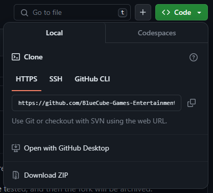

# Rules
  - Forks are to be created, instead of pushing code regularly.
  - 
    - this is an example
  - File Conflicts caused by merging are to be properly resolved in the Issues tab.
  - The original members of Bluecube will be Co-founders, and anybody who joins afterward is simply "Member"
  - Make sure forks are private
  - Please try to use https://desktop.github.com/ (reccomended for beginners or if you dont want to use a command line) or the _official_ Git CLI that has existed from the beginning of Git from https://git-scm.com/ (if you are experienced or want to get experience for the future) with bigger commits (e.g. more than 1 file changed at a time) when possible, as your changes will be included in one commit.

  - If you don't know how to use those tools, here is a basic tutorial for each. First, clone the repository. Go to GitHub
    and click the green code button. You should see this:
     

    Copy the HTTPS link and then move on to the next step.
  - For GitHub Desktop, click File > Clone Repository
     
    
 and paste the HTTPS link to get a local copy of the repository on your machine.
     
Next, use an IDE or text editor, (we suggest using Visual Studio Code https://code.visualstudio.com/Download) to edit the code. Use repository > push to push your commits to the GitHub repository. It should show up in GitHub after 20 seconds and a refresh. Use repository > pull to update your local copy of the repository when someone does a commit. (Please remember, though, that at Bluecube, instead of using "repository > push", we require you to fork the repository, use "repository > push" on the forked repository, and then make a GitHub pull request with that fork!)
 

  - For the Git CLI, here is a quick tutorial for basic commits on the main branch: First, use use "git clone [https clone source]" to get a local copy of the repository on your machine, change the files however you want using whichever tools you want (we recommend Visual Studio Code). Next, use "git add --all" to add all your files to the commit, use "git commit -m [commit message]" to actually do a commit, and use "git push" to push the changes to the repository. The commit should show up in GitHub after 30 seconds and a full refresh if you did it correctly. Use "git pull" to update the local copy of your repository when someone does a commit. (Please remember, though, that at Bluecube, instead of using "git push", we require you to fork the repository, use "git push" on the forked repository, and then make a GitHub pull request with that fork!)
